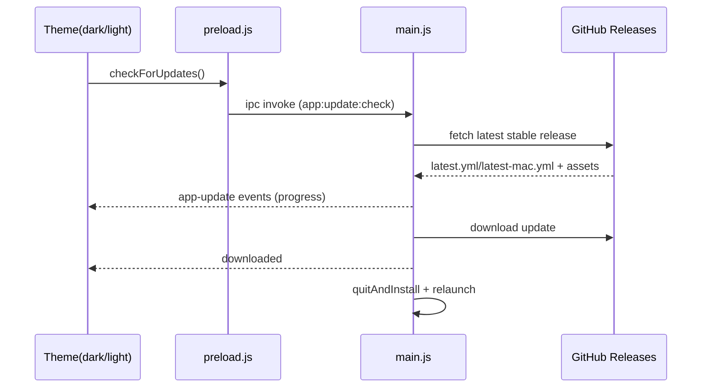

# 技术设计: 应用内自动更新（Issue #24）

## 技术方案

### 核心技术
- `electron-updater`（GitHub provider）：负责版本检查、下载、校验、安装与重启
- `electron-builder`：生成 `app-update.yml` 与 `latest*.yml`/`*.blockmap` 等更新元数据
- IPC：`contextBridge` 暴露更新 API 到主题页，主进程回传更新状态事件

### 实现要点
- 启用条件：
  - 仅在 `app.isPackaged` 且平台为 `win32`/`darwin` 启用自动更新
  - Linux（deb）不执行自动更新：返回“不支持自动更新”的提示
- 手动触发：
  - 主题页按钮 → `window.electronAPI.checkForUpdates()` → `ipcMain.handle` → `autoUpdater.checkForUpdates()`
- 状态回传：
  - 主进程监听 `autoUpdater` 事件并 `mainWindow.webContents.send('app-update', payload)`
  - 主题页监听并用 `showStatus()` 展示 `checking / available / progress / downloaded / not-available / error`
- 安装与重启：
  - `update-downloaded` 后延迟 1-3 秒调用 `autoUpdater.quitAndInstall()`（避免“静默重启”）

## 架构设计

## API设计（IPC）
- `app:update:check`（invoke）→ `{ supported: boolean, started?: boolean, message?: string }`
- `app:update:event`（send，main → renderer）→ `{ type: string, message?: string, info?: any, progress?: any }`

## 安全与性能
- 仅手动触发更新检查，不做后台定时轮询
- `allowPrerelease=false`，忽略 prerelease
- 依赖 `latest*.yml` 中的 `sha512` 校验更新包完整性
- 不引入额外的远程配置或私有 token；公共仓库使用匿名访问即可（注意 GitHub API 限流时的错误提示）

## 测试与部署
- 打包产物要求：
  - Windows：`latest.yml` + `*.blockmap` + 安装包（NSIS）
  - macOS：`latest-mac.yml` + `*.blockmap` + `zip`（用于更新）+ `dmg`（用于手动安装）
  - Linux：deb 仅手动更新（仍可上传 deb 到 Release）
- CI/Release：
  - `.github/workflows/release.yml` 需把 `latest*.yml`/`*.blockmap`/mac 的 `zip` 一并上传到 GitHub Release
- 手工验证建议：
  1. 构建并发布一个旧版本（例如 `v1.2.0`）
  2. 再发布新版本（例如 `v1.2.1`）
  3. 在旧版本中点击“检查应用更新”，观察下载、安装与重启是否按预期完成
