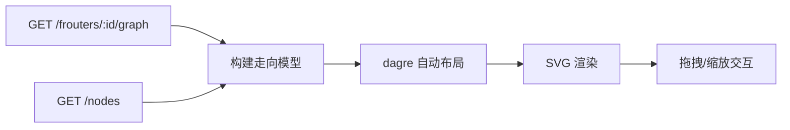

# 技术设计: FRouter 静态走向流程图

## 技术方案

### 核心技术
- **渲染:** SVG（在主题页内渲染，避免引入额外渲染层）
- **交互:** 原生 Pointer Events + Wheel（拖拽平移、滚轮缩放）
- **布局:** dagre 0.8.5（MIT，自动布局 directed graph；vendor: `frontend/theme/_shared/vendor/dagre-0.8.5.min.js`；license: `frontend/theme/_shared/vendor/dagre-0.8.5.LICENSE`；来源: unpkg）
- **数据:** 复用后端现有图 API `GET /frouters/:id/graph` 与节点列表 `GET /nodes`

### 实现要点
1. **数据获取**
   - 走向图以“静态配置”为准：按选中 FRouter 拉取 `/frouters/:id/graph`（edges/slots/positions），并拉取 `/nodes` 用于 nodeId → 节点名称映射。
   - slot 处理：
     - 已绑定 slot：解析为 `boundNodeId`，图中直接使用绑定节点（不单独显示 slot）
     - 未绑定 slot：标记为“未绑定/穿透”，并在图中提示该边会被编译跳过

2. **走向模型构建（尽量与后端编译语义一致）**
   - 以 `from=local` 的边作为“规则”输入（默认/路由规则），每条规则生成一个“规则节点”承载匹配条件文本。
   - 计算 detour 链路：
     - `via` 形成的 hop 链路 + 显式 detour 边（`from!=local`）共同生成 `detourUpstream` 映射
     - 对每条规则：`rule -> to`，若 `to` 为节点，则沿 `detourUpstream` 追踪形成完整 hop 链路
   - 终止节点：`direct`/`block` 作为显式终点节点
   - 注意：禁用边默认不进入“有效走向”，但可在图中以灰态显示（可读性优先，最终由实现阶段确认）

3. **自动布局**
   - 使用 dagre 生成节点坐标：
     - `rankdir=LR`（从左到右：入口 → 规则 → 去向/链路）
     - 规则节点尺寸较大（容纳文本），节点节点尺寸较小
   - 不依赖前端构建工具：将 `dagre.min.js` 以 vendor 形式置入 `frontend/theme/_shared/vendor/`，并由两套主题的 `index.html` 以 `<script>` 引入（暴露全局 `window.dagre`）。

4. **SVG 渲染与交互**
   - DOM 结构：`viewport div`（裁剪区域） → `svg` → `g(transform)`（缩放/平移） → `nodes/edges`
   - 拖拽平移：pointerdown/move/up 更新 translate
   - 滚轮缩放：以鼠标位置为缩放中心，更新 scale，并联动 translate 保持指针下的世界坐标稳定
   - tooltip：使用 SVG `<title>` 展示规则全文，正文仅展示摘要（避免过长撑爆节点）

## 架构设计

## 架构决策 ADR

### ADR-002: 使用 dagre 进行前端自动布局，并以 vendor 方式集成
**上下文:** 需要在主题页中实现“走向图”的自动布局，同时主题页是静态 HTML/JS（无稳定的 bundler 产物管线），并且需要在 Electron 打包后仍可用。  
**决策:** 选择 dagre（dist/UMD）作为布局引擎，将 `dagre-0.8.5.min.js` 固定版本 vendored 到 `frontend/theme/_shared/vendor/`，由 `frontend/theme/dark/index.html` 与 `frontend/theme/light/index.html` 引入，业务代码通过 `window.dagre` 使用。  
**理由:** dagre 体积相对可控、使用简单、许可证清晰（MIT），不需要 worker/wasm，适合纯静态集成。  
**替代方案:**  
- elkjs → 拒绝原因: 体积更大、运行成本更高、集成复杂度更高  
- 自研布局 → 拒绝原因: 复杂度高且难以维护，超出本次需求  
**影响:** 需要在仓库保留第三方许可证文件，并在 how.md 记录版本与来源；未来升级需同步更新 vendor 文件与许可证说明。

## API 设计
无变更。

## 安全与性能
- **安全:** 走向图默认仅展示 nodeName/nodeId 与规则摘要；插入文本必须经过转义，避免 XSS（规则内容来自用户输入/订阅）。
- **性能:** 对长文本做截断；布局与渲染仅在选中/展开时执行；必要时对超大量规则增加渲染上限或折叠策略。

## 测试与部署
- **手工验证:**
  - 空规则/仅默认规则/多路由规则/含 via 链路/含 detour 边/含 slot 绑定与未绑定
  - 缩放/拖拽流畅，且不影响原有点击选择、双击打开路由规则编辑器、右键菜单行为
- **回归:**
  - `make dev` 启动后端+Electron，验证两套主题均正常加载
