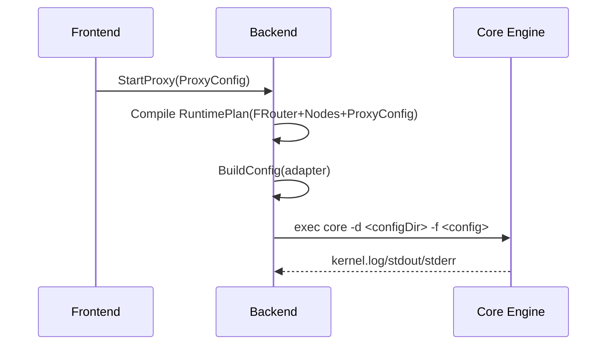

# 架构设计

## 总体架构

```mermaid
flowchart TD
    UI[Electron 前端] -->|HTTP 127.0.0.1:19080| API[Go 后端 API]
    API --> Compile[Plan 编译/规则生成]
    API --> Adapter[内核适配器 adapters/*]
    Adapter --> Core[sing-box / mihomo(Clash)]
    API --> Persist[状态持久化 <userData>/data/state.json]
```

## 技术栈
- **后端:** Go（HTTP API + 进程管理）
- **前端:** Electron（主题页面 + SDK）
- **数据:** 本地状态快照（JSON），运行时目录 `artifacts/`/`data/`

## 核心流程（启动代理）



## 重大架构决策

| adr_id | title | date | status | affected_modules | details |
|--------|-------|------|--------|------------------|---------|
| ADR-001 | FRouter 作为一等操作单元 | 2026-01-05 | ✅已采纳 | backend/frontend | 见 `history/2026-01/202601050639_fix-clash-tun-dns/how.md`（本次变更未新增 ADR，仅引用示例） |
